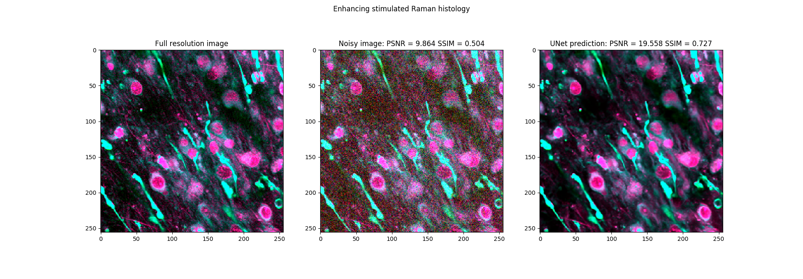
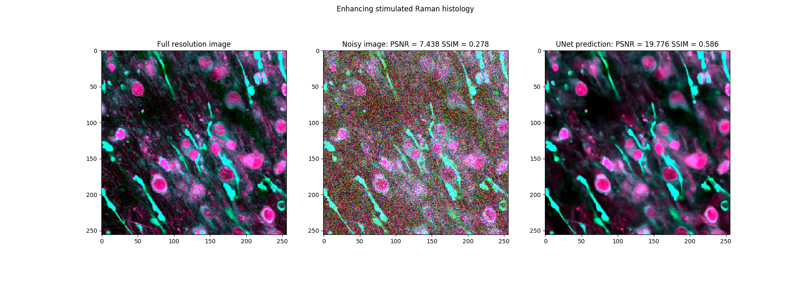
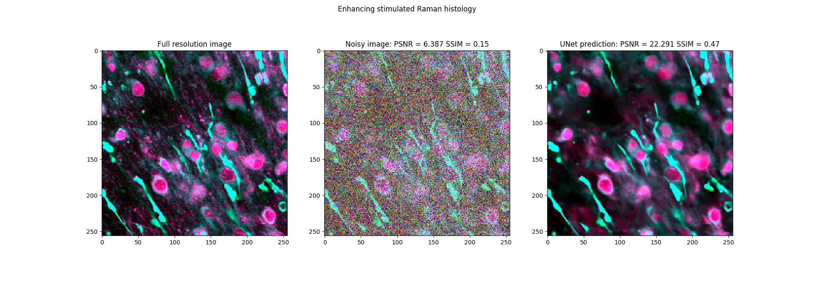
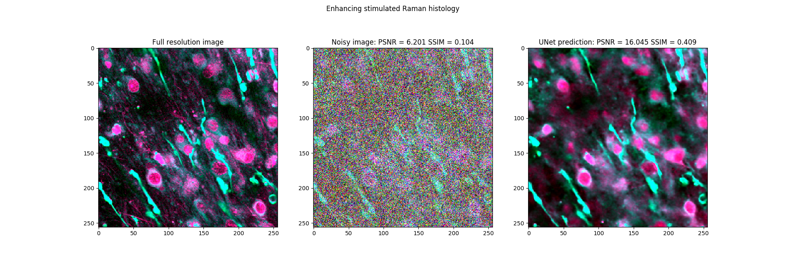
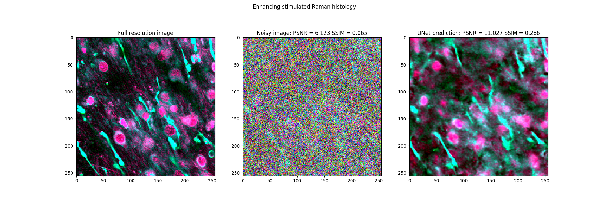

# Enhance SRH 
Source code to improve stimulated Raman histology images via deep learning-based methods:

1) Denoising
2) Super-resolution
3) Colorization

  <b>Weakly supervised denoising of SRH using U-Nets</b>  
  
  
  
  
  

